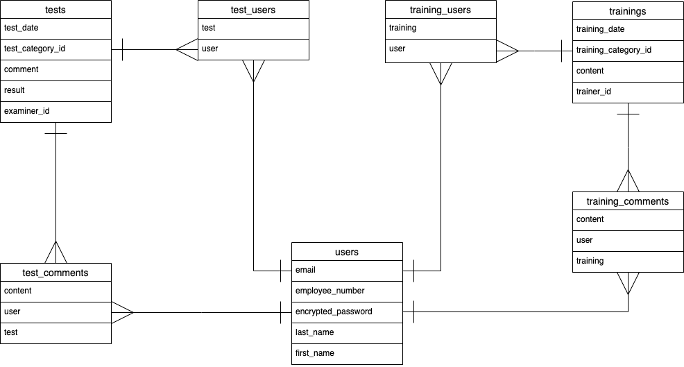

# アプリケーション名

TrainingApp

# アプリケーション概要

研修後や試験後に実施内容を共有し、ユーザー同士でコミュケーションをとることで、進捗管理とモチベーション低下の防止を実現できる。

# URL

[http://52.196.251.175/](http://52.196.251.175/)

# テスト用アカウント

- Basic認証パスワード：admin
- Basic認証ID：2222
- メールアドレス：test2@test
- パスワード：aaa111

# 利用方法

## <u>研修内容投稿</u>

1. トップページのヘッダーからユーザー新規登録を行う
2. ヘッダー研修内容投稿のリンクから、研修内容（研修日、研修生氏名、研修カテゴリー、コメント）を入力し投稿する

## <u>試験結果投稿</u>

ヘッダー試験結果投稿のリンクから、試験結果（試験日、研修生氏名、試験カテゴリー、点数、コメント）を入力し投稿する

## <u>他者へのコメント投稿</u>

1. 研修内容一覧ページ（試験結果一覧ページ）から詳細をクリックし、研修内容（試験結果）の詳細を確認する
2. 投稿内容に対して応援や情報を補足したい場合はコメントを投稿する

# アプリケーションを作成した背景

現職におけるこれまでの経験やスタッフへの聞き取りから、「スタッフ教育の進捗管理ができない」ことや「研修生が現場で放置されモチベーションが下がっている」という課題が明らかとなった。課題を掘り下げ「スタッフがいつ、どんなことを学び、どんな結果だったかということが共有されていない」ことが原因であると仮説を立てた。この原因を解決するため、研修後や試験後に実施内容を共有し、ユーザー同士でコミュケーションをとることで、進捗管理とモチベーション低下の防止を実現できるアプリケーションを開発することにした。

# 洗い出した要件

[要件を定義したシート](https://docs.google.com/spreadsheets/d/1D2CgBK5BylX71FBA2R0Ymg0CwxIqnXhaP8zOsszFe5g/edit#gid=982722306)

# 実装した機能についての画像やGIFおよびその説明

## ユーザー管理機能

### **<u>新規登録機能</u>**

ヘッダーの「新規登録」リンクを押すと新規登録画面に遷移する。フォームからユーザー情報（email、社員番号、苗字、名前、パスワード）を入力し、「Sign up」ボタンを押すとユーザー登録できる。「新規登録」リンクは未ログイン時のみ表示される。

- 社員番号は10桁の数字のみ登録できる。
- 登録されている社員番号は使用できない。
- 苗字、名前はひらがな、漢字、カタカナ、英字のみ入力できる。

### **<u>ログイン機能</u>**

ヘッダーの「ログイン」リンクを押すとログイン画面に遷移する。登録されたユーザー情報（email、パスワード）を入力し、「Log in」ボタンを押すとログインする。「ログイン」リンクは未ログイン時のみ表示される。

### **<u>ログアウト機能</u>**

ヘッダーの「ログアウト」リンクを押すとログアウトする。ログアウト後はログインページに遷移する。「ログアウト」リンクはログイン時のみ表示される

### **<u>マイページ表示機能</u>**

ヘッダーの「ユーザー氏名」リンクを押すとマイページに遷移する。社員番号、苗字、名前を見ることができる。ログインユーザーのマイページのみに編集ボタンが表示される。研修対象ユーザーとして登録された研修内容投稿が存在する場合、研修日、研修カテゴリー、研修実施ユーザー氏名がページ下部に一覧で表示される。受験ユーザー氏名として登録された試験結果投稿が存在する場合、試験日、試験カテゴリー、試験実施ユーザー氏名、点数がページ下部に一覧で表示される。「ユーザー氏名」リンクはログイン時のみ表示される。

### **<u>ユーザー一覧機能</u>**

ヘッダーの「ユーザー一覧」リンクを押すとユーザー一覧ページに遷移する。詳細ボタン、社員番号、ユーザー氏名がユーザーごとに一覧で表示される。「ユーザー一覧」リンクはログイン時のみ表示される。

### **<u>ユーザー情報編集機能</u>**

マイページから「編集」ボタンを押すと編集ページ編遷移する。フォームに編集したユーザー情報（E-mail、社員番号、名字、名前）を入力し、「更新」ボタンを押すと情報が更新される。

## 研修内容管理機能

### **<u>研修内容投稿機能</u>**

ヘッダーの研修内容投稿リンクから研修内容（研修生氏名、研修日、研修カテゴリー、コメント）を入力し、「投稿する」ボタンを押すと投稿される。投稿後は研修内容一覧ページへ遷移する。

- 研修日は今日以前の日付のみ選択できる。

### **<u>研修内容一覧機能</u>**

投稿された研修内容の一覧を表示する。投稿は作成日時が新しいものが上に来るように並んでいる。詳細ボタン、研修日、研修生氏名、研修カテゴリー、研修担当者氏名が研修内容ごとに一覧で見ることができる

### **<u>研修内容詳細機能</u>**

一覧ページにおいて各投稿の詳細ボタンを押すと研修内容の詳細ページへと遷移する。詳細ページでは投稿された研修内容の詳細を表示する。研修日、研修生氏名、研修カテゴリー、担当者氏名、コメントを見ることができる。自身が投稿した研修内容の場合は、「編集」ボタンと「削除」ボタンが表示される。下部にはその投稿に紐付くコメントの投稿フォームと紐付くコメントの一覧を表示し、「戻る」ボタンを押すと一覧ページへ遷移する。

### **<u>研修内容編集機能</u>**

投稿された研修内容を編集する。詳細ページで「編集」ボタンを押すと編集ページへ遷移する。研修内容（研修日、研修生氏名、研修カテゴリー、コメント）を編集し、「編集する」ボタンを押すと投稿内容が更新される。更新後は詳細ページに遷移する。

「戻る」ボタンを押すと詳細ページへ遷移する。

### **<u>研修内容削除機能</u>**

投稿された研修内容を削除する。詳細ページにおいて「削除」ボタンをクリックすると確認ダイアログが表示され、「OK」を選択すると削除される。削除後は一覧ページに遷移する。

## 試験結果管理機能

### **<u>試験結果投稿機能</u>**

ヘッダーの研修内容投稿リンクから試験結果（受験者氏名、試験日、試験カテゴリー、点数、コメント）を入力し、「投稿する」ボタンを押すと投稿される。投稿後は試験結果一覧ページへ遷移する。

- 試験日は今日以前の日付のみ選択できる。
- コメントを任意で登録できる。
- 点数は0以上100以下の数字のみ入力できる。

### **<u>試験結果一覧機能</u>**
投稿された試験結果の一覧を表示する。投稿は作成日時が新しいものが上に来るように並んでいる。詳細ボタン、試験日、受験者氏名、試験カテゴリー、点数、試験官氏名が研修内容ごとに一覧で見ることができる

### **<u>試験結果詳細機能</u>**

一覧ページにおいて各投稿の詳細ボタンを押すと試験結果の詳細ページへと遷移する。詳細ページでは投稿された試験結果の詳細を表示する。試験日、受験者氏名、試験カテゴリー、点数、コメント、試験官指名を見ることができる。自身が投稿した試験結果の場合は、「編集」ボタンと「削除」ボタンが表示される。下部にはその投稿に紐付くコメントの投稿フォームと紐付くコメントの一覧を表示し、「戻る」ボタンを押すと一覧ページへ遷移する。

### **<u>試験結果編集機能</u>**

投稿された試験結果を編集する。詳細ページで「編集」ボタンを押すと編集ページへ遷移する。試験結果（試験日、受験者氏名、試験カテゴリー、点数、コメント）を編集し、「編集する」ボタンを押すと投稿内容が更新される。更新後は詳細ページに遷移する。

「戻る」ボタンを押すと詳細ページへ遷移する。

### **<u>試験結果削除機能</u>**

投稿された試験結果を削除する。詳細ページにおいて「削除」ボタンをクリックすると確認ダイアログが表示され、「OK」を選択すると削除される。削除後は一覧ページに遷移する。

## コメント管理機能

### **<u>コメント投稿機能</u>**

研修内容詳細ページ（試験結果詳細ページ）においてコメントを投稿することができる。コメントをフォームに入力し、「送信」ボタンを押すと＜コメント一覧＞の下に投稿したコメントが表示される。

### **<u>コメント削除機能</u>**

自身が投稿したコメントを削除することができる。自身が投稿したコメントのみ左側に画像が表示され、画像を押すとコメントが削除される。

# データベース設計

## usersテーブル

| Column             | Type   | Options                   |
| ------------------ | ------ | ------------------------- |
| employee_number    | string | null: false               |
| email              | string | null: false, unique: true |
| encrypted_password | string | null: false               |
| last_name          | string | null: false               |
| first_name         | string | null: false               |

## Association

- has_many :training_comments
- has_many :test_comments
- has_many :training_users
- has_many :trainings, through: :training_users
- has_many :test_users
- has_many :tests, through: :test_users

## trainingsテーブル

| Column               | Type    | Options     |
| -------------------- | ------- | ----------- |
| training_date        | date    | null: false |
| training_category_id | integer | null: false |
| content              | text    | null: false |
| trainer_id           | integer | null: false |

## Association

- has_many :training_comments
- has_many :training_users
- has_many :users, through: :training_users

## training_usersテーブル

| Column   | Type       | Options                        |
| -------- | ---------- | ------------------------------ |
| user     | references | null: false, foreign_key: true |
| training | references | null: false, foreign_key: true |

## Association

- belongs_to :user
- belongs_to :training

## training_commentsテーブル

| Column   | Type       | Options                        |
| -------- | ---------- | ------------------------------ |
| user     | references | null: false, foreign_key: true |
| training | references | null: false, foreign_key: true |
| content  | text       | null: false                    |

## Association

- belongs_to :user
- belongs_to :training

## testsテーブル

| Column           | Type    | Options     |
| ---------------- | ------- | ----------- |
| test_date        | date    | null: false |
| test_category_id | integer | null: false |
| result           | integer | null: false |
| examiner_id      | integer | null: false |
| comment          | text    |             |

## Association

- has_many :test_comments
- has_many :test_users
- has_many :users, through: :test_users

## test_usersテーブル

| Column | Type       | Options                        |
| ------ | ---------- | ------------------------------ |
| user   | references | null: false, foreign_key: true |
| test   | references | null: false, foreign_key: true |

## Association

- belongs_to :user
- belongs_to :test

## test_commentsテーブル

| Column  | Type       | Options                        |
| ------- | ---------- | ------------------------------ |
| user    | references | null: false, foreign_key: true |
| test    | references | null: false, foreign_key: true |
| content | text       | null: false                    |

## Association

- belongs_to :user
- belongs_to :test

# 画面遷移図

# 開発環境
- HTML/CSS
- Ruby/Ruby on Rails/JavaScript
- AWS
- RSpec
- Visual Studio Code
- Github

# ローカルでの動作方法
以下のコマンドを順に実行

% git clone https://github.com/matsuikohei/trainingApp.git

% cd trainingApp

% bundle install

% yarn install

# 工夫したポイント

1. 進捗管理をしやすくするため、マイページに研修と試験の記録を表示した。これによりユーザー毎に進捗が把握しやすく、また、次に何を行うかを計画できるようになっている。

2. ユーザビリティ向上のため、コメント投稿機能はJavaScriptによる非同期実装を利用した。その際、コメントの即時反映を行うためにAction Cableを利用した。